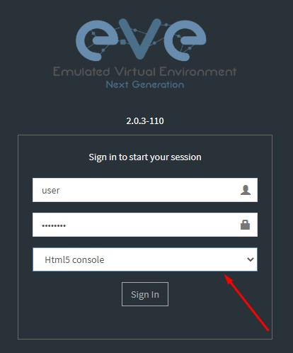
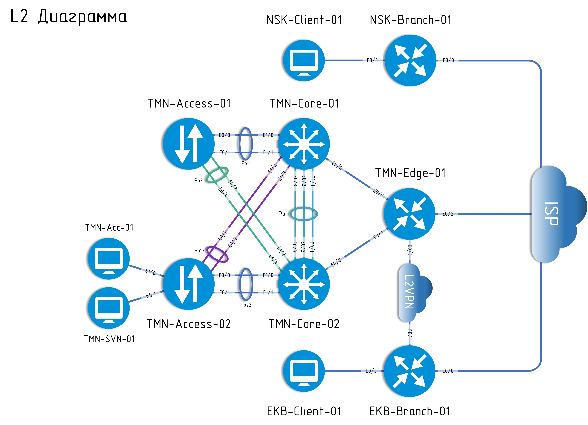
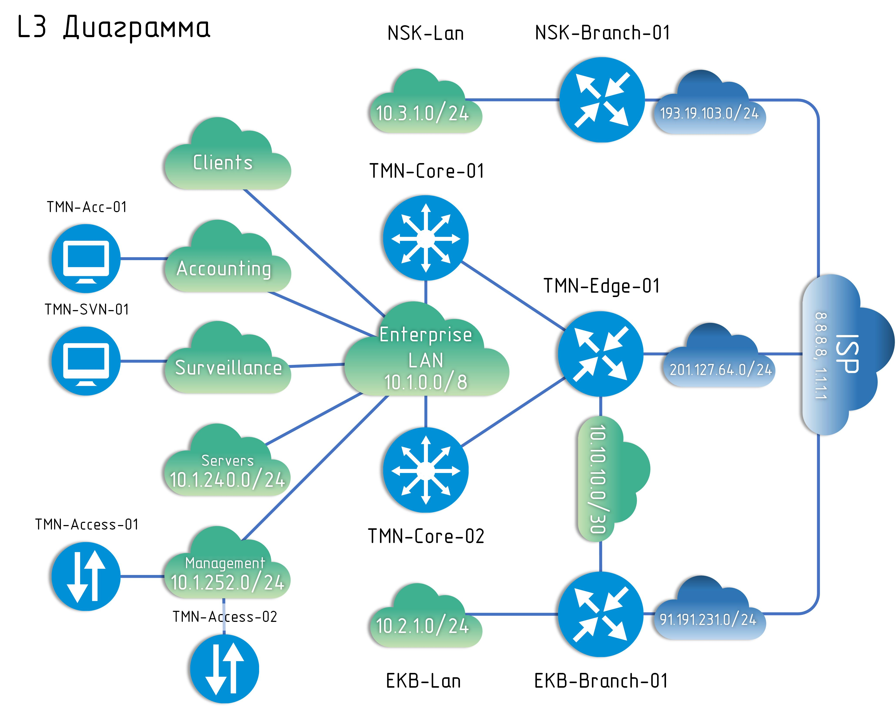

*Практическое задание по сетевым технологиям*
==========
Содержание
==========

1.  [Содержание](#содержание)

2.  [Введение](#введение)

    1.  [Описание конкурсного задания](#описание-конкурсного-задания)

    2.  [Инструкции для участника](#инструкции-для-участника)

    3.  [Цели конкурсного задания](#цели-конкурсного-задания)

        1.  [Проверка стартовой конфигурации](#проверка-стартовой-конфигурации)

        2.  [Network Fundamentals. Разработка IP-адресации](#network-fundamentals.-разработка-ip-адресации)

        3.  [Network Access. VLAN, EtherChannel и STP](#network-access.-vlan-etherchannel-и-stp)

        4.  [IP Connectivity. Статическая и динамическая маршрутизация](#ip-connectivity.-статическая-и-динамическая-маршрутизация)

        5.  [IP Services](#ip-services)

        6.  [Security Fundamentals](#security-fundamentals)

3.  [Диаграммы](#диаграммы)

Введение
========

Описание конкурсного задания
----------------------------

Данное задание разработано с учетом различных сетевых технологий,
соответствующих уровню сертификации CCNA 200-301, и состоит из следующих
секций:

-   Network Fundamentals

-   Network Access

-   IP Connectivity

-   IP Services

-   Security Fundamentals

Какие-то секции раскрыты подробнее, какие-то более поверхностно.
Например, в нынешней версии сертификации, стек протоколов IPSec описан,
но не подразумевает конфигурацию. В данном задании есть необходимость
его настройки, хоть и с некоторыми допущениями. Стоит понимать, что
задание может выполнятся нелинейно, например:

1)  Настройте динамическую маршрутизацию с помощью протокола OSPF между
    **MSK-Gateway-01**, **MSK-Gateway-02** и MSK-Gateway-03

2)  Используйте IP-адреса из таблицы №6 для настройки интерфейсов
    маршрутизаторов **MSK-Gateway-01** и **MSK-Gateway-02**

Очевидно, что мы не можем выполнить первый пункт задания, пока не
выполним второй. Вы должны сперва прочитать внимательно задание
**полностью** и только потом строить план его решения.

Также, необходимо учитывать то, что проверка будет автоматической. В
качестве средства автоматической проверки будет использоваться фреймворк
pyATS.

Инструкции для участника
------------------------

1.  Прочитайте всё задание целиком, прежде чем конфигурировать
    устройства. Для достижения любой части задания, вам может
    потребоваться выполнение предыдущей или следующей части.

2.  Прежде чем выполнять задание, проверьте, что вы имеете доступ до
    всех необходимых вам устройств. Во время выполнения, если
    какое-нибудь устройство заблокировано или недоступно -- вы должны
    это починить. После выполнения конкурсного задания, удостоверьтесь,
    что все устройства доступны для оценки. Вы потеряете баллы, если
    проверяемые устройства не будут доступны во время проверки.

3.  Конфигурация устройств, исследование инфраструктуры и поиск
    неисправностей -- часть умений, которые проверяются во время
    выполнения конкурсного задания.

4.  Оценивается только рабочая конфигурация. Проверьте работоспособность
    всей конфигурации прежде, чем закончится время выполнения задания.
    Будьте осторожны, во время выполнения одной части задания есть
    возможность сломать то, что было сделано до этого.

5.  Баллы даются только за полностью выполненный пункт задания.

6.  Сохраняйте конфигурацию чаще!

7.  Для настройки Access-list, prefix-list, route-map и т.д. используйте
    только буквы и цифры. Не используйте знаки препинания и специальные
    символы (.,;:\'/\|\\?!(){}\*&\^%\$\#@).

8.  Удостоверьтесь, что ваша конфигурация работает после перезагрузки
    устройств.

9.  Если вам необходимо настроить пароль, но не сказано какой -
    используйте **P\@ssw0rd**

10. Ни в коем случае не удаляйте пользователя **do_not_delete_this_user** и не
    изменяйте виртуальные линии с **10 по 15** эта учетная запись используется для 
    автоматизированной проверки
11. При подключении по веб интерфейсу к своему стенду используйте свою учетную запись
    и режим **HTML Console**
    

Цели конкурсного задания
------------------------

### Проверка стартовой конфигурации

1.  Имена всех устройств и виртуальных машин заданы заранее в
    соответствии с топологией.

2.  Сетевое оборудование и виртуальные машины скоммутированы в
    соответствии с топологией.

3.  Часть IP-адресов уже сконфигурировано. Например, на
    **NSK-Branch-01** и **EKB-Branch-01** настроен статический IP-адрес
    на внутреннем интерфейсе. На **TMN-Edge-01** настроены статические
    IP-адреса на всех интерфейсах. На коммутаторах **TMN-Core-01** и
    **TMN-Core-02** настроены IP-адреса на интерфейсах, подключенных к
    **TMN-Edge-01** и т.д. Далеко не вся информация отображена на **L2**
    и **L3** схемах. Проявите навык исследования незнакомой сетевой
    инфраструктуры.

4.  Во время проектирования и настройки IP-адресации, учитывайте, что
    Gateway -- всегда последний адрес в подсети, а IP-адрес клиента --
    первый, в случае, когда клиентов или Gateway-устройств больше чем
    один -- используется следующий адрес в подсети, если в пункте
    задания не указано что-то другое. Например, в подсети **Management**
    на **TMN-Core-01** назначен последний адрес в подсети (.254),
    **TMN-Core-02** - следующий адрес с конца (.253), на
    **TMN-Access-01** -- первый адрес в подсети (.1), **TMN-Access-02**
    -- второй адрес в подсети (.2) и т.д.

### Network Fundamentals. Разработка IP-адресации

Разработайте схему IP-адресации и VLAN в центральном офисе в
соответствии с таблицей №1. Используйте блок IP-адресов
«**10.1.0.0/22**» для выделения подсетей. Помните, что начинать
выделение стоит с наибольшей по размеру подсети.

**Tаблица №1:**

  |**Подсеть**       |  **Максимальное количество узлов** | **Номер VLAN**  |
  |------------------| -----------------------------------| ----------------|
  |**Clients**       | 300                                | 100             |
  |**Accounting**    | 64                                 | 200             |
  |**Surveillance**  | 20                                 | 300             |

### Network Access. VLAN, EtherChannel и STP

1.  На устройствах, в соответствии с L2/L3 диаграммами и разработанной
    вами схемой адресации и VLAN, создайте виртуальные интерфейсы и
    назначьте IP-адреса.

2.  Настройте EtherChannel в соотвествии с L2 диаграммой. Используйте
    протокол LACP. Агреггированные каналы должны работать в режиме L2 и
    передавать тегированные кадры. В целях безопасности следует изменить
    Native VLAN на Trunk портах.

3.  Настройте порты доступа, к которым подлючены клиентские виртуальные
    машины. Эти порты не должны дожидаться пересчета Spanning-Tree и
    сразу переходить в состояние Forwarding.

4.  Коммутатор **TMN-Core-01** должен являтся Root Bridge, в случае
    отказа **TMN-Core-01**, Root Bridge должен стать коммутатор
    **TMN-Core-02**.

5.  Включите использование Rapid-PVST на всех коммутаторах.

### IP Connectivity. Статическая и динамическая маршрутизация

1.  Обеспечьте прохождение трафика между всеми клиентами внутри
    организации (включая филиалы, используя VPN-туннели). Используйте
    протокол динамической маршрутизации **OSPF** в зоне 0.

2.  На **EKB-Branch-01** - L2VPN соединение должно обеспечивать
    отказоустойчивый доступ в Интернет через основной офис, в случае
    если основной канал недоступен.

3.  Настройте службу **HSRP** между **TMN-Core-01** и **TMN-Core-02** во
    всех внутренних подсетях. Используйте **TMN-Core-01** как
    **активный** узел по-умолчанию и последний свободный IP-адрес
    (например, .252) как виртуальный.

4.  При отключении всех интерфейсов на **TMN-Core-01** работоспособность
    сети не должна быть нарушена.

### IP Services

1.  Синхронизируйте время на всех сетевых устройствах используя NTP
    (time zone TMN +5). Настройте иерархическую модель синхронизации
    времени. Используйте **8.8.8.8** для синхронизации **TMN-Edge-01**.
    Все остальные устройства, должны синхронизировать время с
    **TMN-Edge-01**.

2.  Все сетевые устройства должны быть доступны для удаленного
    управления по протоколу SSH.

3.  Клиентские машины в главном офисе должны
    получать IP-адрес с помощью DHCP. Расположите сервер на
    **TMN-Edge-01**. Исключите из выдачи последние 3 адреса в каждой
    подсети.

4.  Все клиентские машины в главном офисе и филиалах должны иметь доступ
    в интернет.

### Security Fundamentals

1.  Настройте на всех сетевых устройствах пользователя **ciscouser** с
    паролем **P\@ssw0rd**. Пользователь должен обладать максимальным
    уровнем привилегий. Для доступа в привилегированный режим настройте
    пароль **P\@ssw0rd**.

2.  Аутентификация должна производится с помощью **AAA**. После успешной
    аутентификации при удалённом подключении пользователи сразу должен
    получать права, соответствующие их уровню привилегий. Настройте
    необходимость аутентификации на локальной консоли и виртуальных
    линиях (**не меняйте линии с 10 по 15**).

3.  Используя преднастроенные туннельные интерфейсы и IPSec профили на
    **TMN-Edge-01**, настройте GRE-туннель и IPSec до маршрутизатора
    **NSK-Branch-01**.

4.  На порту, к которому подключена виртуальная машина
    **TMN-Acc-01**, включите и настройте Port Security. Адреса должны
    определяться динамически. Максимальное количество адресов -- 2. При
    попытке подключения устройства с адресом, нарушающим политику, порт
    должен быть отключен.

Диаграммы
---------
********

*******

